# E-commerce Sales Exploratory Data Analysis Using python
## Internship 2
## Project Overview
This project focuses on performing exploratory data analysis (EDA) on an e-commerce sales dataset using python and pandas to identity patterns, trends, distributions, and customer behaviour insights.

The analysis aims to support data-driven decision-making by uncovering key business insights related to sales performance, customer engagement, revenue generation, and promotional effectiveness.

## Project Objectives

The main objectives of this project were to:

- Analyze sales and revenue performance
- Identify customer purchasing patterns
- Examine monthly sales and revenue trends
- Evaluate product performance
- Analyze coupon usage behavior
- Examine referral source effectiveness
- Understand payment preferences
- Explore relationships between numerical variables
- Generate actionable business insights and recommendations

## Dataset Description

The dataset contains e-commerce transaction records including:

- Customer information
- Product purchases
- Revenue-related fields
- Payment methods
- Order statuses
- Coupon usage
- Referral sources
- Transaction dates

The dataset used for this analysis was previously cleaned and prepared during the data cleaning phase of the project.

## Tools and Technologies Used

- Python
- pandas
- NumPy
- matplotlib
- seaborn
- Jupyter Notebook
- Microsoft Excel

## Exploratory Data Analysis Performed

The following analyses were conducted during the project:

1. Product Sales Analysis
2. Product Revenue Analysis
3. Monthly Sales Trend Analysis
4. Monthly Revenue Trend Analysis
5. Revenue Distribution Analysis
6. Order Status Analysis
7. Payment Method Analysis
8. Coupon Usage Analysis
9. Coupon Usage Across Referral Sources
10. Referral Source Analysis
11. Customer Behavior Analysis
12. Correlation Analysis

## 📊 Key Findings & Business Insights

### 1. Revenue Performance & Product Contribution
- **Total Revenue Generated:** `$1,264,761.96`
- **Average Order Value:** `$1,053.97`

- **Key Insight:** High transaction volume did not necessarily translate into the highest revenue generation. While **Printers** recorded the highest number of sales transactions (181 sales), **Chairs** generated the highest total revenue (`$195,620.11`) due to their higher unit price contribution.

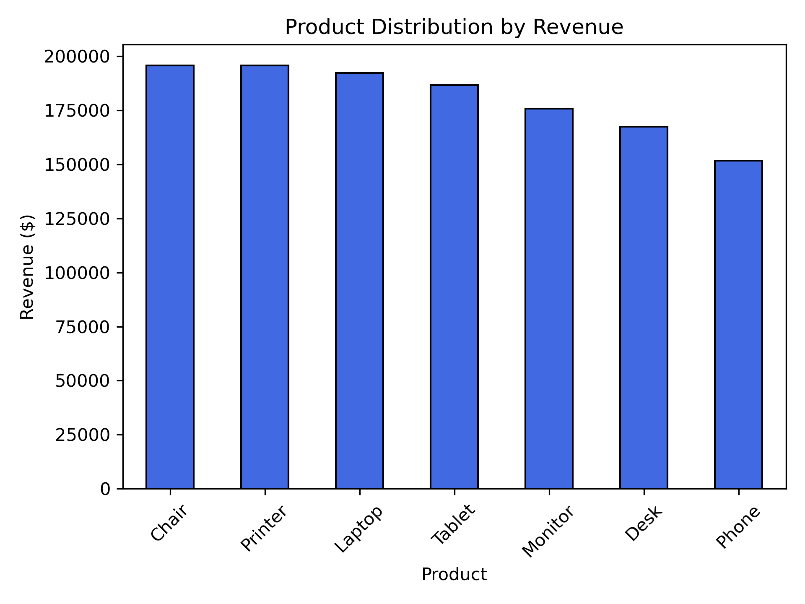

---

### 2. Coupon Usage & Promotional Effectiveness
- **Coupon Adoption Rate:** Approximately **74.25%** of all transactions involved the use of a coupon code, indicating strong customer responsiveness to promotional incentives.

- **Most Frequently Used Coupons:**
  - `FREESHIP` — 313 uses
  - `WINTER15` — 292 uses
  - `SAVE10` — 286 uses

- **Key Insight:** Free shipping promotions emerged as the most effective discount strategy, suggesting that customers were highly motivated by reduced delivery costs.

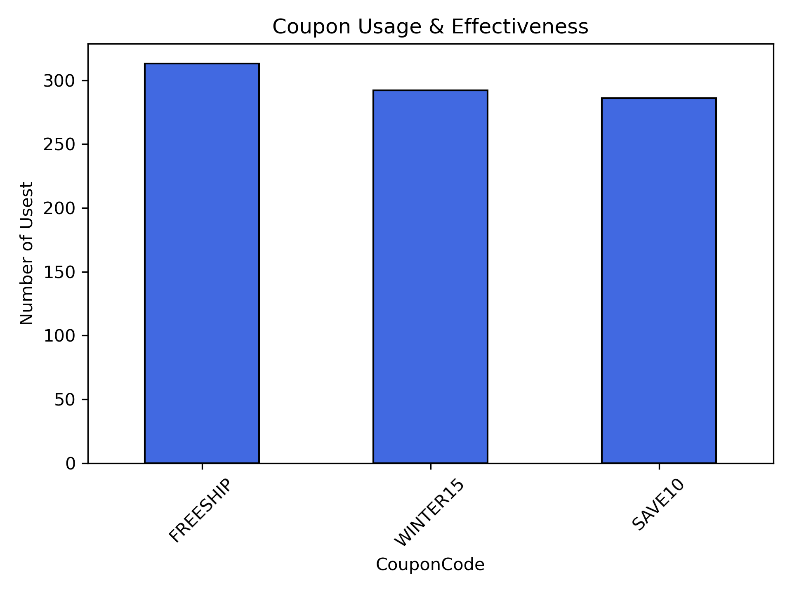

---

### 3. Referral Source & Coupon Engagement
- **Top Referral Source:** **Instagram** generated the highest customer traffic and coupon engagement activity.

- **Behavioral Insight:** Customers acquired through Instagram demonstrated the strongest response to promotional campaigns, particularly free shipping offers. In contrast, customers arriving through Google showed stronger engagement with direct price-reduction coupons such as `SAVE10`.

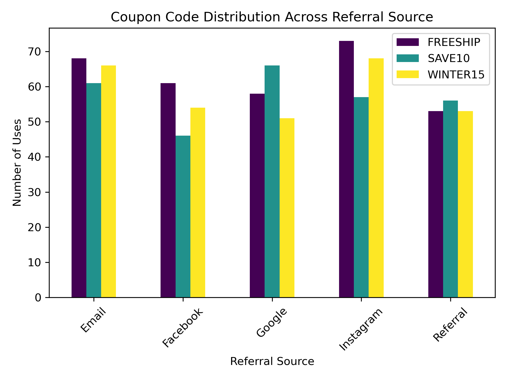

---

### 4. Monthly Sales & Revenue Trends
- **Peak Performance Month:** June recorded the highest sales and revenue activity across the dataset.

- **Trend Insight:** Sales and revenue patterns fluctuated throughout the year, with noticeable peaks during mid-year periods. This suggests possible seasonal purchasing behavior or increased customer activity during certain months.

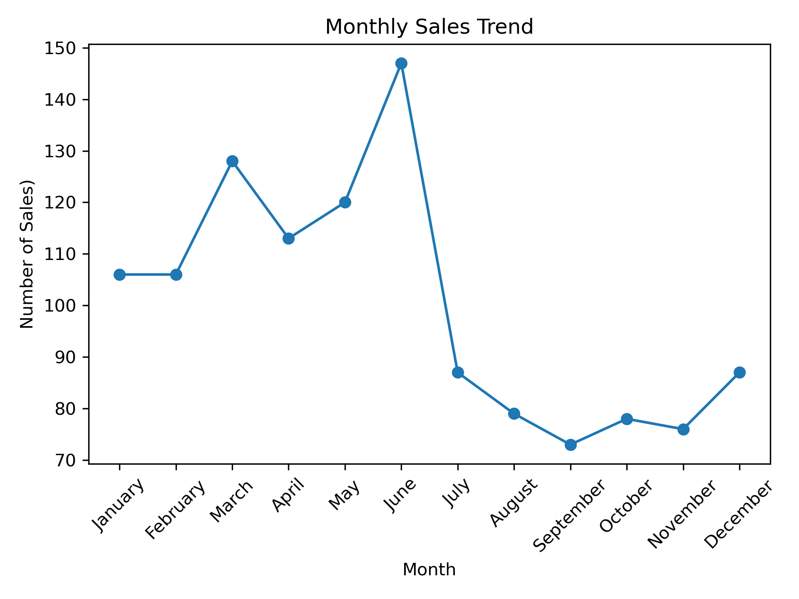
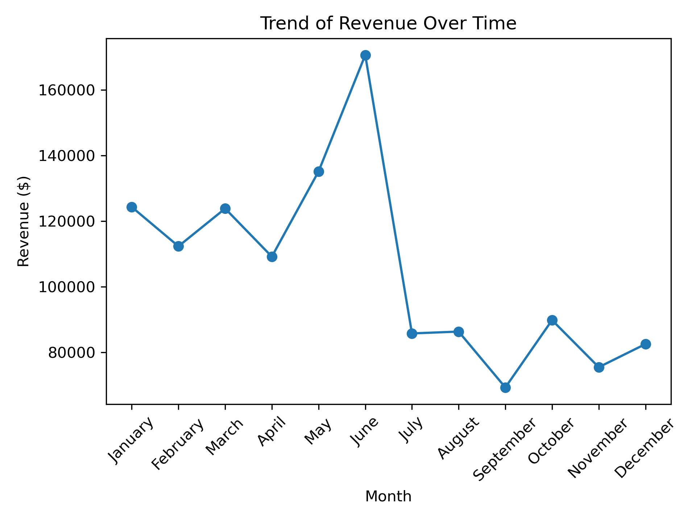

---

### 5. Revenue Distribution & Purchase Behavior
- **Distribution Pattern:** Revenue distribution followed a right-skewed pattern, where the majority of transactions were concentrated within lower purchase ranges.

- **Breakdown:**
  - Nearly 400 transactions fell within the `$0–$500` range
  - Approximately 300 transactions fell within the `$500–$1,000` range
  - High-value purchases above `$3,000` were relatively rare

- **Key Insight:** The business generated most of its transaction volume from lower-value purchases, while high-ticket orders contributed a smaller but significant portion of overall revenue.

---

### 6. Payment Preference Analysis
- **Most Preferred Payment Method:** Online payment methods recorded the highest transaction frequency across the dataset.

- **Key Insight:** Customers demonstrated a strong preference for digital payment channels, highlighting the importance of maintaining seamless online payment experiences.

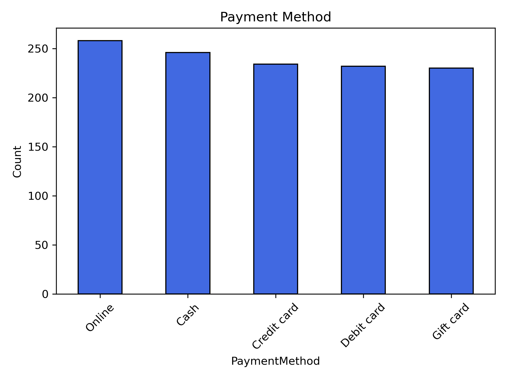

---

### 7. Customer Value & Outlier Detection
- **Top Customer:** Customer `C38840`
- **Total Customer Revenue Contribution:** `$5,723.23`

- **Key Insight:** Customer spending behavior revealed the presence of high-value customer outliers who contributed disproportionately higher revenue compared to the average customer spend.

### Customer Value Analysis
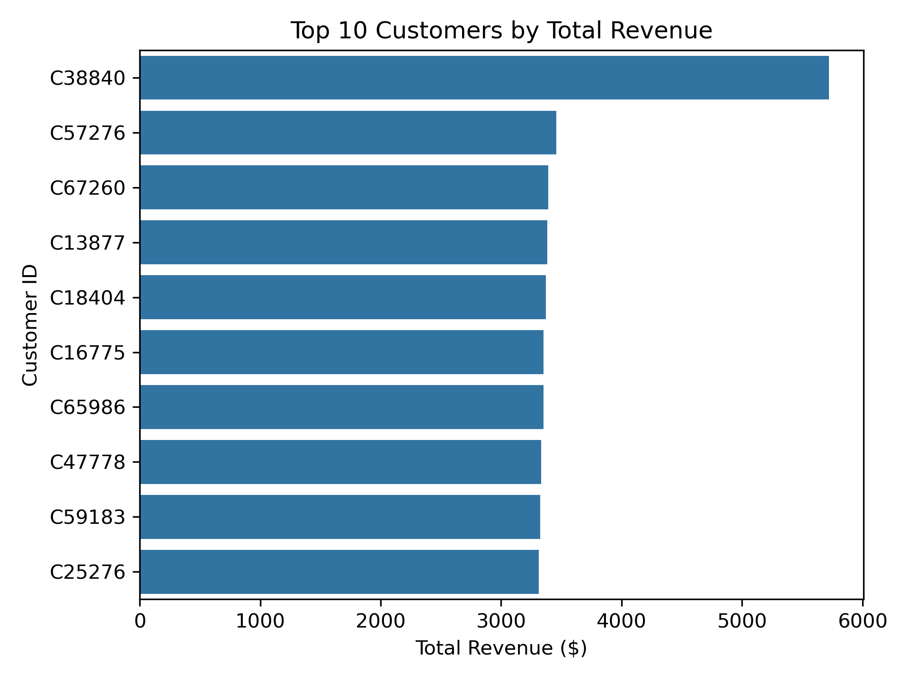

---

### 8. Order Status Performance

- **Order Distribution:** Cancelled orders recorded the highest transaction count (250 orders), followed closely by returned (247), pending (237), shipped (235), and delivered orders (231).

- **Revenue Contribution by Status:**
  - Cancelled — `$276,396.21`
  - Pending — `$256,328.15`
  - Delivered — `$242,600.32`

- **Key Insight:** Cancelled orders generated the highest revenue contribution within the dataset, while delivered orders recorded the lowest revenue values. This unusual distribution suggests that high-value transactions are disproportionately cancelled.

- **Operational Observation:** Additionally the cancellation distribution across products and payment methods appeared highly uniform throughout the dataset, suggesting that the dataset may represent a structured or simulated transactional environment rather than entirely organic customer behavior.

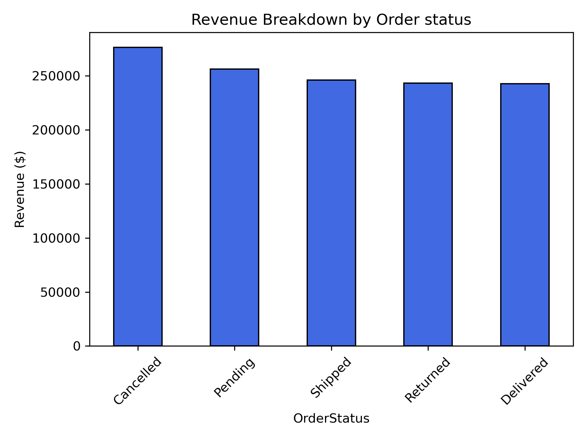

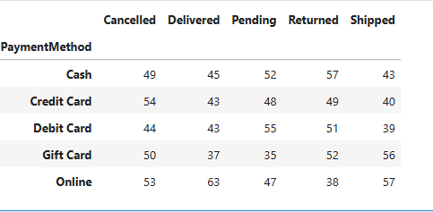

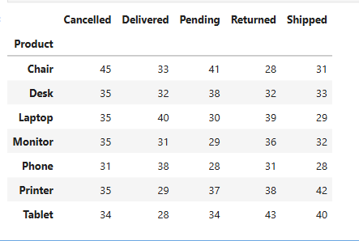

---

### 9. Correlation Analysis
- **Strongest Correlation Identified:** `UnitPrice` and `TotalRevenue` (`0.72` correlation coefficient)

- **Additional Relationship:** `Quantity` also showed a moderately strong positive relationship with `TotalRevenue` (`0.62` correlation coefficient).

- **Key Insight:** The analysis indicates that both product pricing and purchase quantity contributed significantly to revenue generation. However, product pricing demonstrated a slightly stronger influence on total revenue compared to purchase volume.

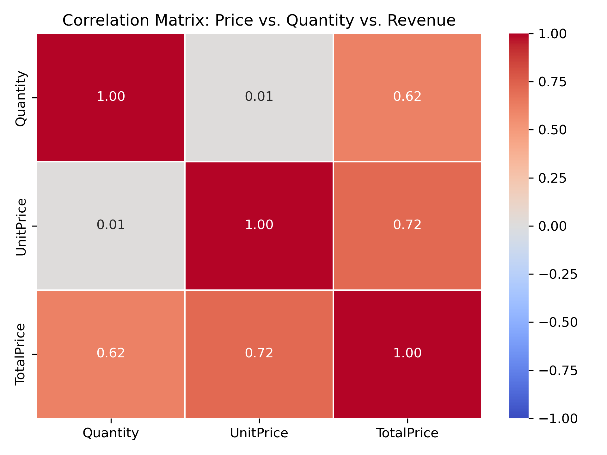

---

## Recommendations

Based on the analysis, the following recommendations were identified:

- Increase marketing efforts on Instagram due to its strong customer engagement and revenue contribution.
- Expand free shipping promotional campaigns since coupon engagement was high.
- Focus inventory and marketing strategies on high-performing products.
- Investigate the high cancellation and return rates to reduce revenue loss.
- Develop customer retention strategies for high-value customers.

---

## Skills Demonstrated

This project demonstrates practical skills in:

- Exploratory Data Analysis (EDA)
- Data Visualization
- Business Insight Generation
- Trend Analysis
- Correlation Analysis
- Customer Behavior Analysis
- Statistical Interpretation
- Python Programming
- pandas Data Manipulation
- Data Storytelling

---

## Files Included

| File | Description |
|---|---|
| `Cleaned_dataset for Data Analytics.xlsx` | Cleaned dataset used for analysis |
| `Project 2_Exploratory_data_analysis.ipynb` | Jupyter Notebook containing the EDA workflow |
| `Project 2_Exploratory_data_analysis.html` | HTML export of the notebook |
| `README.md` | Project documentation |

---

## Conclusion

This project successfully analyzed an e-commerce sales dataset to uncover important patterns, trends, distributions, and customer behavior insights.

The analysis provided valuable insights into product performance, customer engagement, promotional effectiveness, revenue generation, and sales trends, supporting data-driven business decision-making.
